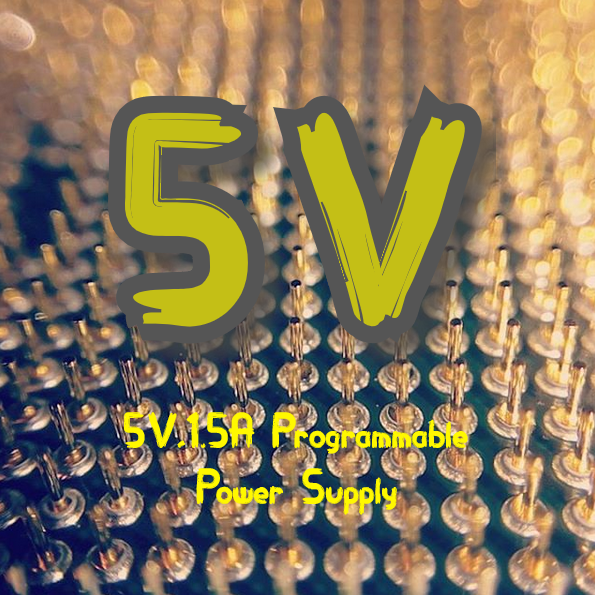

# 5V,1.5A Programmable Power Supply 

## Overview
A power supply which can be programmed through PC and set the voltage from 0-5V with 5mV resolution.

The PC software can monitor Current and Voltage and set voltage and the limit for maximum current.
If the current at output is greater than the limit a buzzer produce a sound.
Minimum load must be 5mA for proper function.
Input voltage can be from 6.5V minimum to 35V maximum.
The project include a flashing led just to know that the microprocessor operates,this led can be set ON/OFF
from the PC software.
Inverse polarity protection included.

### Project
This is a university project for Microprocessors lesson which is taught from mr. V.Tenentes.

Team name : 5V

Team : Kontotoli Voula,Ketoglou Theocharis 

